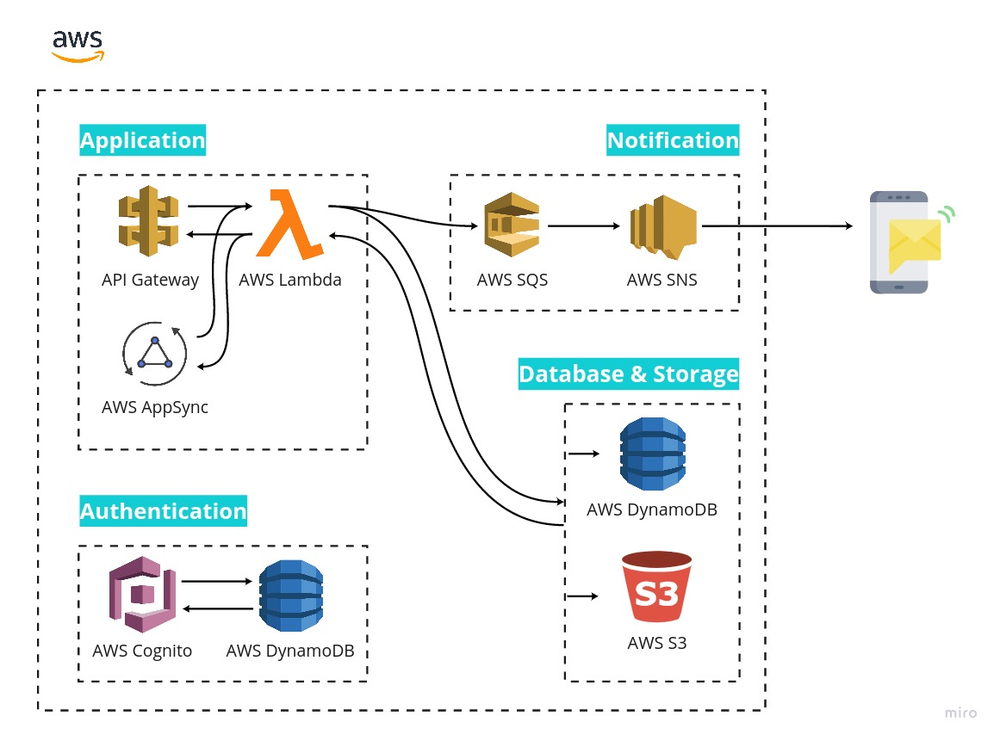

## Rippo Backend
Este repositório destinasse aos códigos ultilizados para a construção do backend do projeto Rippo
 

## Arquitetura 🔨
Na parte do backend foi criada toda uma infraestutura serverless na aws se ultilizando de vários serviços, que pudessem suprir as necessidades encontradas durante o projeto.




## Rodando 🔥🔥

O projeto precisa de alguns requisitos para funcionar, então o primeiro passo é instalar as libs necessárias para fazer o projeto fucionar, você pode fazer isso seguindo os links abaixo.

1. [AWS cli](https://docs.aws.amazon.com/cli/latest/userguide/install-cliv2.html)
2. [Serverless framework](https://www.serverless.com/framework/docs/providers/aws/guide/installation/)
3. [Configuração do serverless](https://www.serverless.com/framework/docs/providers/aws/guide/credentials/)

Após a instalação a configuração dos serviços na sua máquina, bastar rodar o seguinte comando na pasta root do projeto:

```
sls deploy
```

Esse comnando vai fazer com que a infraestrutura necessária seja criada na aws, que são as APis e o serviços externos ultilizados. 

Após isso ao acessar o painel da lambda na sua conta da aws ja será possível encontrar os lambdas que foram criados, para garantir que eles vão funcionar é adicionar as variáveis de ambiente o nome da tabela que deve ser usada no dynamo. 

E pronto, a infraestutura ja está pronta para ser usada, ela provém uma api rest mas também uma api em graphql que foi usada para a comunicação com o frontend.